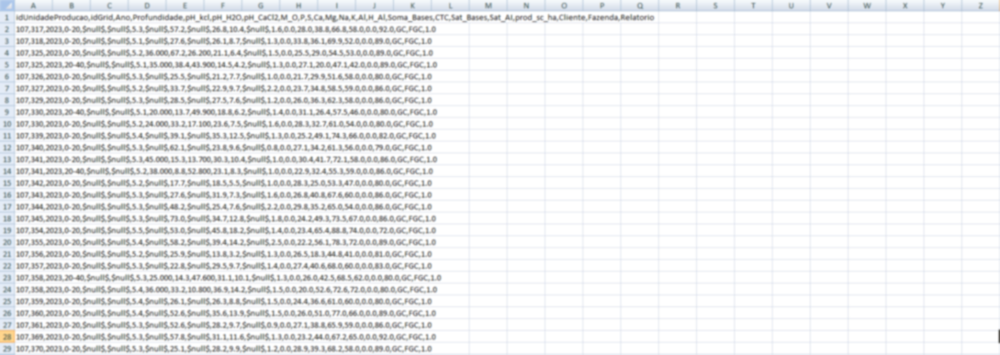
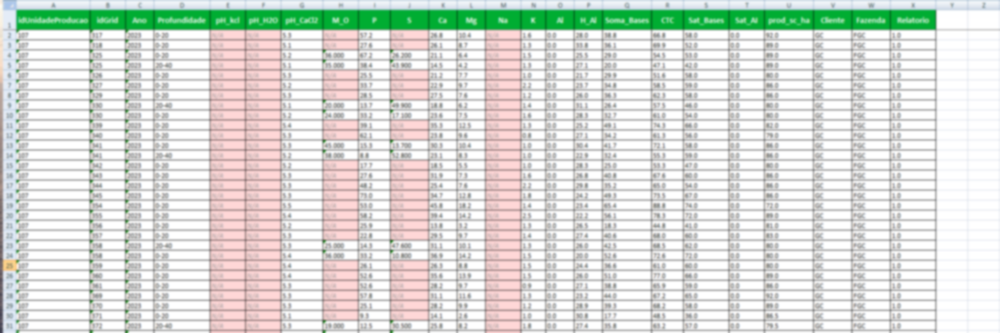

# 📊 CSV Interpreter

Converts messy CSV files into clean, formatted Excel spreadsheets (.xlsx).

---

## 📸 Example

> Blur was applied to the images below to prevent data leakage.

**Before** — raw CSV, no formatting:



**After** — processed and formatted spreadsheet:



---

## 🖥️ Desktop App (recommended)

Just run `CSVInterpreter.exe` — no Python or dependencies required.

1. Click **Selecionar arquivo CSV** and pick your file
2. Click **Processar e salvar** and choose the output folder
3. Toggle the 🔒 checkbox before processing to generate a protected (read-only) spreadsheet

---

## 🐍 Running from source

### Requirements

Python 3.12+ is required. Install all dependencies with:

```bash
pip install -r requiriments.txt
```

| Package | Version | Purpose |
|---|---|---|
| pandas | 2.2.3 | CSV reading and data manipulation |
| openpyxl | 3.1.5 | Excel file generation and formatting |
| pillow | 12.2.0 | Icon conversion (build only) |
| pyinstaller | 6.20.0 | .exe packaging (build only) |

> `tkinter` is used for the GUI and comes built-in with Python on Windows — no install needed.

### Run the GUI

```bash
python src/app.py
```

### Run via CLI (batch mode)

Place CSV files in the `data/` folder, then:

```bash
python src/main.py
```

Output files will be saved to the `output/` folder.